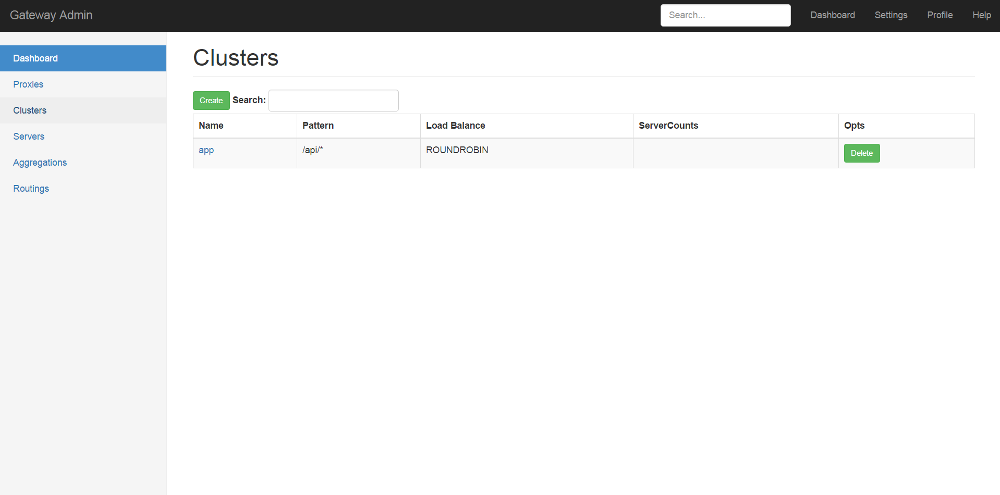
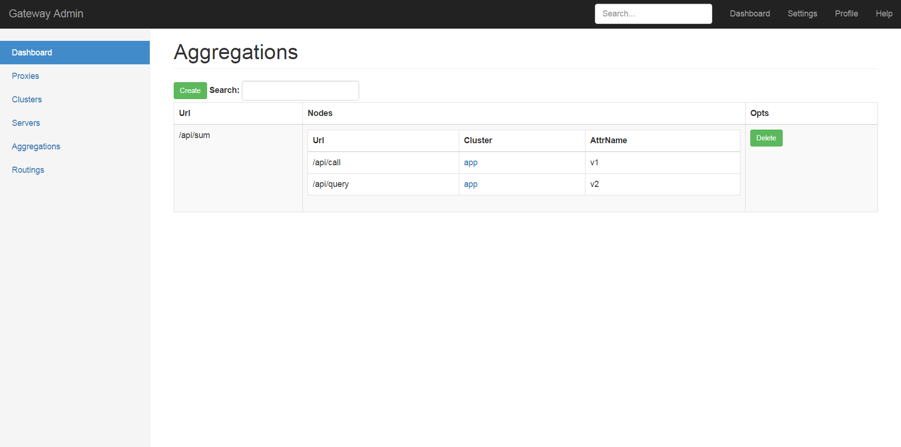
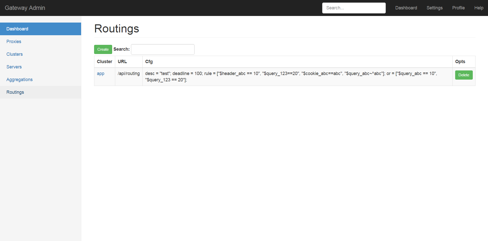
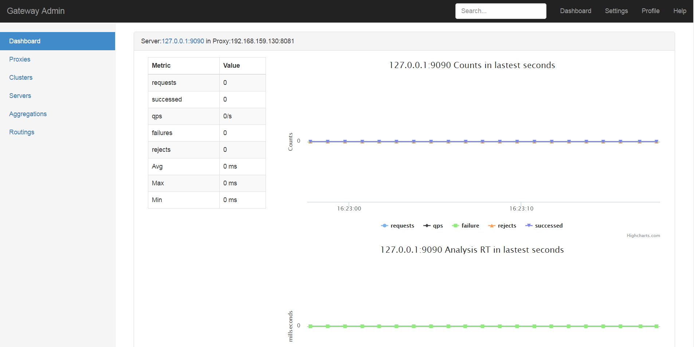

#Gateway

Gateway是一个API网关，工作在7层，对外提供HTTP服务，提供以下功能

* 流控
* 熔断
* 负载均衡
* 基于URL的路由分发
* 服务聚合
* 管理后台

安装
----
Gateway依赖[etcd](https://github.com/coreos/etcd)

Gateway自身有2个组件

* gateway 网关
* admin 管理后台

###通过源码安装
建议使用go1.6+
```
git clone https://github.com/fagongzi.git
cd $GOPATH/src/github.com/fagongzi/gateway
go build cmd/proxy/proxy.go
go build cmd/admin/admin.go
```

# 2.0 版本
使用fasthttp代替golang http包，性能提升

# 概念
gateway有以下几个概念：

* proxy
gateway的前台proxy

* admin
gateway的后台管理，一个admin可以管理同一个namespace（即etcdPrefix参数指定）下的所有proxy

* cluster
一个集群，集群中包含一组提供相同服务的server

* server
一个backend server

* aggregation
聚合，针对一个cluster和URL做聚合配置，一个聚合URL请求，会在proxy上扩散成多个子URL请求，然后做合并处理，返回数据。

* routing
路由，可以根据queryString,cookie,request header等信息做请求路由。

# 流控
流控是限制多大的流量进入后端server而设计的，支持针对单个server的流量阈值设置

# 熔断
熔断就是为了解决后端系统被流量冲垮、以及后续的雪崩问题而设计的。熔断把后端server的状态设计为以下三种：

* 打开
这个状态下，流量正常进入后端server
* 半打开
这个状态下，部分流量进入后端server
* 关闭
这个状态下，0流量进入后端server

状态的转换规则为：

* 打开 (后端出错)-> 关闭
* 关闭 (经过一定时间) -> 半打开 
* 半打开 （后端正常响应）-> 打开
* 半打开 （后端正常错误）-> 关闭

负载均衡
---------
目前支持的负载均衡：

* 轮询
* IP Hash

# 基于URL的路由分发
网关把加入到网关的后端server进行分组，形成多个cluster，在cluster上做负载均衡。
多个cluster通过url的规则来进行消息路由

# 服务聚合
为了说清楚这个功能，我们先看一个场景：

在一家互联网公司，一个设计的故事：

* app上有一个页面需要获取用户、订单、物流等多个信息
* app开发人员希望后端人员提供一个单一的接口，同时返回这些数据
* 后端开发人员不认可，目前系统中已经存在这个三个信息的查询接口，让APP开发人员调用三次接口，后端只提供原子服务。
* 各自都有道理，最后出于用户体验和流量的考虑，后端开发妥协，提供了一个聚合接口
* 系统成功上线后，需求变更，这个页面上需要展示更多的信息
* 后端没有办法继续新增一个更大的聚合接口，原先的接口保留，为了更好的兼容
* 这样的页面越来越多，后端的聚合接口也越来越多，非常难以维护

这样的设计显然非常蛋疼，越到后期，越难以维护.

服务聚合就是为了解决这个问题而出现的，后端server只对外提供原子化的接口。对于聚合查询接口由API网关处理，处理流程如下：

* 在admin管理平台上创建一个聚合接口，指定聚合接口的url以及需要聚合的url
* 这个url请求到达网关，网关根据配置，同时请求对应的后端接口
* 等待后端接口返回数据，合并数据返回给客户端

# 管理后台
提供webUI的方式管理网关的配置，例如后端server、集群、服务聚合、流控、熔断等所有功能

提供网关上单个server的各项指标的查看页面

## dashboard


## proxy管理


## cluster管理


## server管理


## 聚合管理


## routing管理


## 监控


