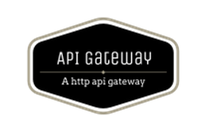
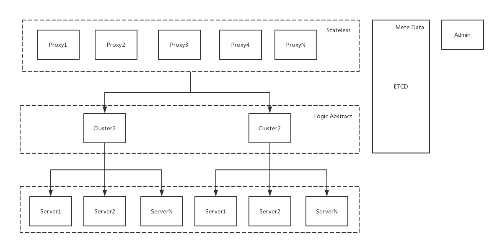

</img>

[](https://gitter.im/fagongzi/gateway?utm_source=badge&utm_medium=badge&utm_campaign=pr-badge)
[](https://travis-ci.org/fagongzi/gateway)
[](https://goreportcard.com/report/github.com/fagongzi/gateway)

Gateway/[简体中文](README_CN.md)
-------
Gateway is a restful API gateway based on HTTP, which can be used as a unified API access layer.

## Tutorial
A very detailed tutorial for beginners. [Link](./docs/tutorial.md)  
Below are video tutorials.  
Basics:  
[](https://www.youtube.com/watch?v=2qMWmdcw7o4)  
Routing Configuration Tutorial:  
[](https://www.youtube.com/watch?v=D1pI6opB_ks)  
JWT Plugin Configuration Tutorial:  
[](https://www.youtube.com/watch?v=sLb16YDSlBs)  

## Attention
Please make sure your Go version is 1.10 or above. Otherwise, **undefined "math/rand".Shuffle** error will occur when compiling. [StackOverFlow Link](https://stackoverflow.com/questions/52172794/getting-undefined-rand-shuffle-in-golang)


## Features
* Traffic Control (on Server or API)
* Circuit Breaker (on Server or API)
* Load Balance
* Service Discovery
* Plugin
* Routing (Divert Traffic, Duplicate Traffic)
* API Aggregation
* API Argument Check
* API Access Control (White and Black List)
* API Default Return Value
* API Customized Return Value
* API Result Cache
* JWT Authorization
* API Metric Imports Prometheus
* API Retry After Failure
* Backend Server Health Check
* Open Management of API (GRPC、Restful)
* Websocket Support
* Online Data Migration Support

## Docker

The following content requires reader some knowledge of Docker. You can refer to [this book][2], or check out [the official documentation][1]。

### Quick Start
Use `docker pull fagongzi/gateway` command to download gateway Docker image.
`docker run -d -p 9093:9093 -p 80:80 -p 9092:9092 fagongzi/gateway` initiates the container. 3 Ports are exposed:

* 80

  Proxy's HTTP port, this port is for client access.

* 9092

  APIServer's external GRPC port

* 9093

  APIServer's external HTTP Restful port. Visit `http://127.0.0.1:9093/ui/index.html` to access the web UI.

Running parameters can be set by the following environment varaibles. Configuration overrides default.

- GW_PROXY_OPTS

   All options in `proxy --help` are supported.

- API_SERVER_OPTS

   All options in `apiserver --help` are supported.

- ETCD_OPTS

   All options in `etcd --help` are supported.

### Available Docker Images
* `fagongzi/proxy`

   proxy component, `production ready`

* `fagongzi/apiserver`

   apiserver component, `production ready`

### Quick start with docker-compose
```bash
docker-compose up -d
```

Use `http://127.0.0.1:9093/ui/index.html` to access `apiserver`

Use `http://127.0.0.1` to access to your API

## Architecture


## Web UI
Available Gateway Web UI Projects：
* [Official](https://github.com/fagongzi/gateway-ui-vue)
* [gateway_ui](https://github.com/archfish/gateway_ui)
* [gateway_admin_ui](https://github.com/wilehos/gateway_admin_ui)

## Components
Gateway consists of `proxy` and `apiserver`.

### Proxy
Proxy is a component which provides service to clients. Proxy is a stateless node. Multiple proxies can be deployed to handle huge traffic.
[More](./docs/proxy.md).

### ApiServer
ApiServer provides GRPC and Restful to manage metadata for users. ApiServer integrates  official Web UI. 
[More](./docs/apiserver.md).

## Concepts of Gateway
### Server
A server is a a real backend service.
[More](./docs/server.md).

### Cluster
Cluster consists of servers which provide the same service. A server is chosen to handle a specific request based on a load balance strategy.
[More](./docs/cluster.md).

### API
API is a key concept of Gateway. We can manage external APIs in Gateway and their distribution rules, aggregation rules and URL matching rules.
[More](./docs/api.md).

### Routing
Routing is a route strategy. Cookie, Querystring, Header and Path in HTTP Request dictate traffic distribution and traffic duplication to a specific cluster. Through this feature, AB test and online traffic divertion is achieved.
[More](./docs/routing.md).

## Getting Involved
[More](./docs/build.md)

## WeChat


[1]: https://docs.docker.com/ "Docker Documentation"
[2]: https://github.com/yeasy/docker_practice "docker_practice"
