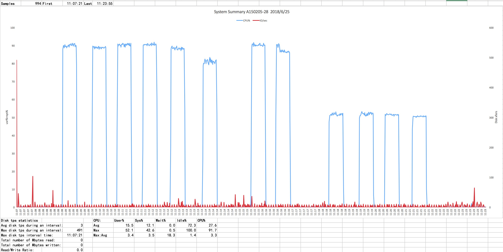
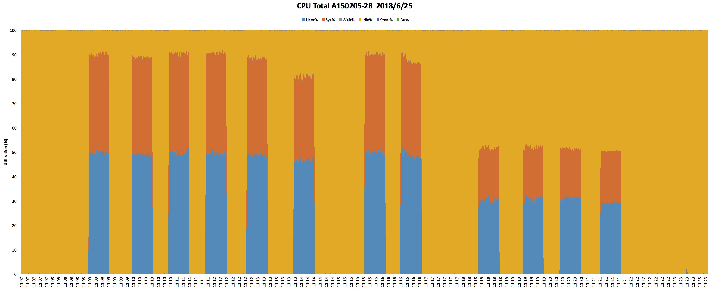

# 非严谨压力测试结果

## Hardware

- Intel(R) Xeon(R) CPU E5-2620 v2 @ 2.10GHz (6C 12T) * 2
- CentOS Linux release 7.2.1511 (Core)
- Linux version 3.10.0-327.10.1.el7.x86_64
- Total 64G，60G available memory
- 1 Gbit/s Network

## Tools

- [nmon](https://www.ibm.com/developerworks/cn/aix/library/analyze_aix/index.html)
- [wrk](https://github.com/wg/wrk)
- [nmon analyser](https://www.ibm.com/developerworks/aix/library/au-nmon_analyser/index.html)

## Code

- gateway -version

  ```log
  GitCommit:  f4e8226
  BuildTime:  2018-06-22T10:43:12+0800
  GoVersion:  go version go1.10.3 darwin/amd64
  ```

- hello world

  ```golang
  package main

  import (
    "flag"
    "log"

    "github.com/valyala/fasthttp"
  )

  var (
    addr = flag.String("addr", ":8080", "TCP address to listen to")
  )

  func main() {
    flag.Parse()

    h := requestHandler

    if err := fasthttp.ListenAndServe(*addr, h); err != nil {
      log.Fatalf("Error in ListenAndServe: %s", err)
    }
  }

  func requestHandler(ctx *fasthttp.RequestCtx) {
    ctx.SetContentType("text/plain; charset=utf8")
    ctx.WriteString("ok")
    ctx.SetStatusCode(200)
  }
  ```

## 备注

- 测试主机划了两颗虚拟CPU和4G内存给一台KVM虚拟机，所以以下数据可能不是该机器的真实水平；
- 测试结果未经筛选全部贴上来了，具体哪个是有效数据自行判断；
- 测试间隔比较短不确定每次测试时主机是否处于最佳状态；
- nmon采集间隔为0.5秒；
- 网关、wrk与hello world程序分别放在不同机器上，之间以千兆网线经交换机通信，无法确定网络对测试结果造成的影响；
- 服务器服役时间略长，小脾气无法预测；
- ε=ε=ε=┏(゜ロ゜;)┛

## Benchmark 1

- limit-conn 512
- limit-cpus 22
- log-level  fatal

### **11:12:40**

```log
Running 30s test @ http://10.0.222.28
  16 threads and 512 connections
  Thread Stats   Avg      Stdev     Max   +/- Stdev
    Latency     4.49ms   33.70ms   1.01s    99.20%
    Req/Sec    13.68k     1.54k   27.58k    75.50%
  6547637 requests in 30.09s, 842.98MB read
Requests/sec: 217581.07
Transfer/sec:     28.01MB
```

### **11:12:35**

```log
Running 30s test @ http://10.0.222.28
  16 threads and 256 connections
  Thread Stats   Avg      Stdev     Max   +/- Stdev
    Latency     2.10ms   22.73ms   1.01s    99.75%
    Req/Sec    13.46k   757.01    21.34k    80.38%
  6431365 requests in 30.05s, 828.01MB read
Requests/sec: 214043.76
Transfer/sec:     27.56MB
```

### **11:13:27**

```log
Running 30s test @ http://10.0.222.28
  16 threads and 512 connections
  Thread Stats   Avg      Stdev     Max   +/- Stdev
    Latency     2.32ms    1.77ms 202.55ms   95.35%
    Req/Sec    13.95k   794.63    25.92k    81.77%
  6675635 requests in 30.08s, 859.46MB read
Requests/sec: 221930.31
Transfer/sec:     28.57MB
```

### **11:14:20**

```log
Running 30s test @ http://10.0.222.28
  20 threads and 512 connections
  Thread Stats   Avg      Stdev     Max   +/- Stdev
    Latency     2.30ms    2.85ms 202.82ms   97.85%
    Req/Sec    11.16k     0.86k   35.87k    90.55%
  6673469 requests in 30.10s, 859.18MB read
Requests/sec: 221739.44
Transfer/sec:     28.55MB
```

### **11:15:20**

```log
Running 30s test @ http://10.0.222.28
  20 threads and 256 connections
  Thread Stats   Avg      Stdev     Max   +/- Stdev
    Latency     1.29ms    4.45ms 205.46ms   99.43%
    Req/Sec    10.86k   682.61    26.00k    80.07%
  6477522 requests in 30.10s, 833.96MB read
Requests/sec: 215212.08
Transfer/sec:     27.71MB
```

### **11:16:30**

```log
Running 30s test @ http://10.0.222.28
  20 threads and 128 connections
  Thread Stats   Avg      Stdev     Max   +/- Stdev
    Latency   642.28us  560.86us  23.03ms   94.23%
    Req/Sec    10.10k   501.26    11.61k    74.30%
  6030275 requests in 30.02s, 776.37MB read
Requests/sec: 200882.13
Transfer/sec:     25.86MB
```

## Benchmark 2

- limit-conn 1024
- limit-cpus 22
- log-level  fatal

### **11:18:11**

```log
Running 30s test @ http://10.0.222.28
  20 threads and 512 connections
  Thread Stats   Avg      Stdev     Max   +/- Stdev
    Latency     2.42ms    4.45ms 211.37ms   98.81%
    Req/Sec    11.00k     1.14k   20.31k    92.25%
  6573249 requests in 30.06s, 846.28MB read
Requests/sec: 218695.25
Transfer/sec:     28.16MB
```

### **11:19:04**

```log
Running 30s test @ http://10.0.222.28
  20 threads and 1024 connections
  Thread Stats   Avg      Stdev     Max   +/- Stdev
    Latency     3.05ms    4.50ms 211.56ms   97.30%
    Req/Sec    11.33k     5.20k   35.16k    70.34%
  6510905 requests in 30.10s, 840.86MB read
  Socket errors: connect 19, read 0, write 0, timeout 129
Requests/sec: 216307.53
Transfer/sec:     27.94MB
```

## Benchmark 3

- limit-conn 512
- limit-cpus 12
- log-level  fatal

### **11:21:03**

```log
Running 30s test @ http://10.0.222.28
  20 threads and 512 connections
  Thread Stats   Avg      Stdev     Max   +/- Stdev
    Latency     2.80ms    2.74ms 206.74ms   96.25%
    Req/Sec     9.09k   776.07    18.41k    70.70%
  5443273 requests in 30.10s, 700.80MB read
Requests/sec: 180850.03
Transfer/sec:     23.28MB
```

### **11:22:00**

```log
Running 30s test @ http://10.0.222.28
  20 threads and 512 connections
  Thread Stats   Avg      Stdev     Max   +/- Stdev
    Latency     4.69ms   35.94ms   1.01s    99.56%
    Req/Sec     9.32k   707.50    17.96k    85.30%
  5572804 requests in 30.10s, 717.48MB read
Requests/sec: 185167.02
Transfer/sec:     23.84MB
```

### **11:22:50**

```log
Running 30s test @ http://10.0.222.28
  20 threads and 1024 connections
  Thread Stats   Avg      Stdev     Max   +/- Stdev
    Latency     4.03ms    1.37ms  31.06ms   73.96%
    Req/Sec     9.55k     3.16k   28.05k    78.17%
  4970559 requests in 30.10s, 673.12MB read
  Socket errors: connect 19, read 0, write 0, timeout 155
Requests/sec: 165155.18
Transfer/sec:     22.37MB
```

### **11:23:53**

```log
Running 30s test @ http://10.0.222.28
  20 threads and 256 connections
  Thread Stats   Avg      Stdev     Max   +/- Stdev
    Latency     1.48ms    2.55ms 211.37ms   99.06%
    Req/Sec     8.54k   651.18    23.57k    84.26%
  5102649 requests in 30.10s, 656.95MB read
Requests/sec: 169524.92
Transfer/sec:     21.83MB
```

## Graph






