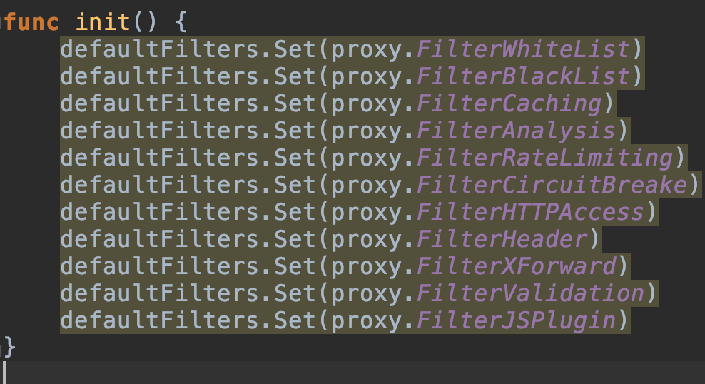
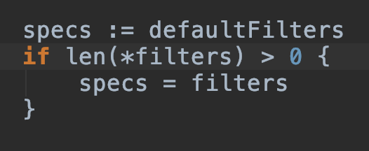

# Tutorial
This tutorial aims to teach you how to make your own plugins.  
If you just started dealing with Gateway and want to add a plugin to fulfill your deployment needs, then congradulations, you have come to the right place!  
I have gone through a lot of pain trying to figure out how to write my JWT plugin. And thanks to the in-time replies of the maintainer and other members of the community, I finally made it. I wrapped up my weary and yet fruitful journey and published this tutorial in the hope that future newcomers have a detailed reference to look up.  
If you encounter any problem going through the tutorial, feel free to create an issue or send me an email to this address **brucewangno1@qq.com** with the subject "Issues with Gateway Tutorial."  

## JWT Plugin Example
First of all, since we are developing a JWT plugin to authenticate external requests, most of us have already had some working knowledge of JWT. If not, [this official introduction](https://jwt.io/introduction/) is pretty informative. For Chinese developers, [this link from Ruan Yifeng's blog](http://www.ruanyifeng.com/blog/2018/07/json_web_token-tutorial.html) is an excellent concise alternative.

### Source Code Walk-through
**pkg/filter/filter.go** is pretty much an empty abstract from which **\*Filters** structs in **pkg/proxy/filter_\*.go** inherit the **BaseFilter** struct. For example, struct **ValidationFilter** only implementes methods **Init()**, **Name()**, and **Pre()**. These methods in **BaseFilter** are overridden and others remain available.  
For JWT plugins, you should name your file like **filter_my_plugin.go** under **pkg/proxy/** and refer to **filter_plugin.go** to write your own.  
**\*.so** plugin as mentioned in the [docs/plugin.md](plugin.md), which involves **cgo** is really troublesome and thus highly discouraged.  
After you have finished your plugin file, a plugin json configuration file is needed. For more information, please reference to [this json configuration file example](https://github.com/fagongzi/jwt-plugin).  
For your JWT plugin to take effect, you need to pass options **--filter JWT** and **--jwt yourJSONConfigurationFilePath**. This is because neither **filter_jwt.go** nor your plugin is in **defaultFilters** in **pkg/proxy/proxy.go**.  

If one of the **defaultFilters** is expected to be used, please specify it by **--filter** like **--filter WHITELIST** when launching **proxy** because if there is **--filter**, **defaultFilters** gets discarded.  

