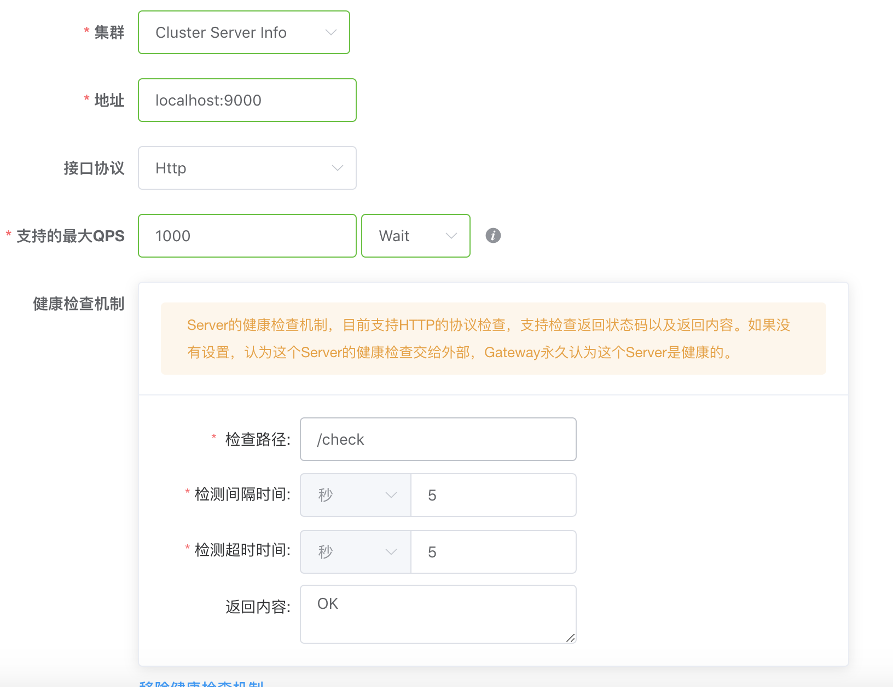
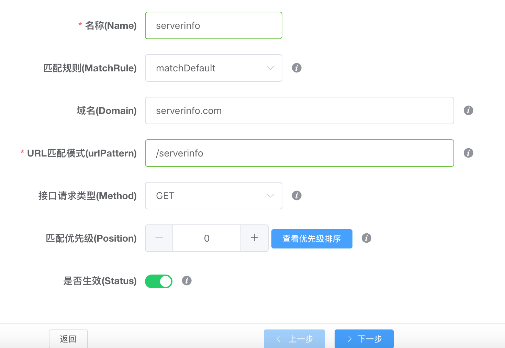
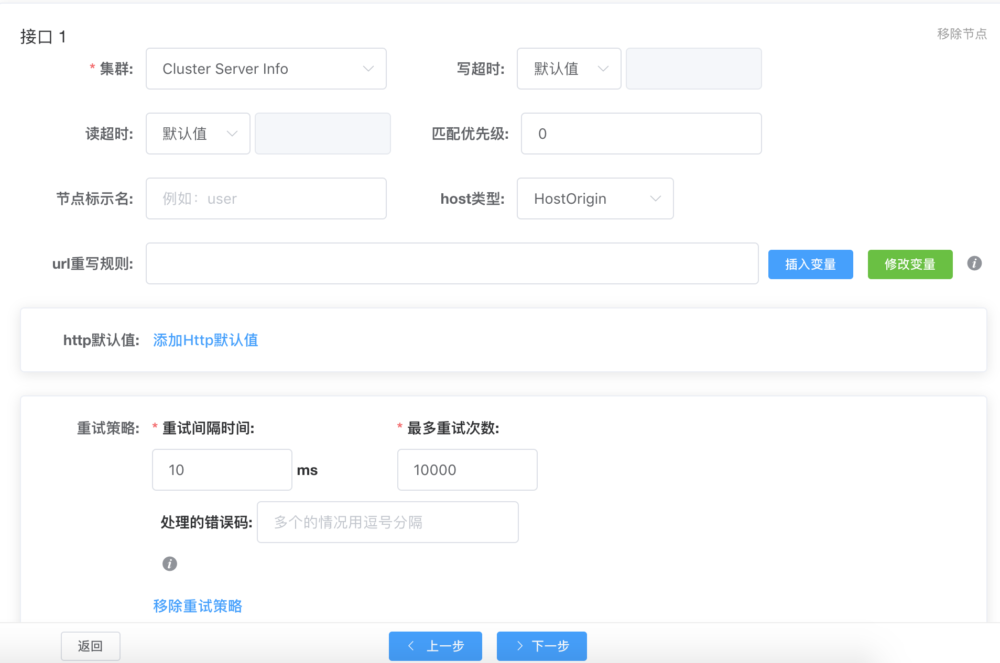
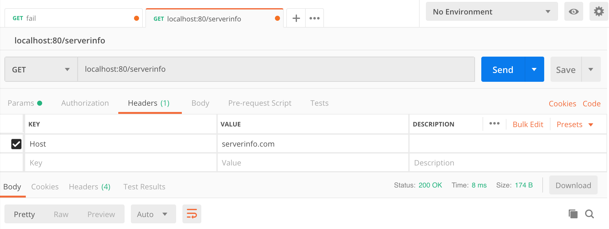
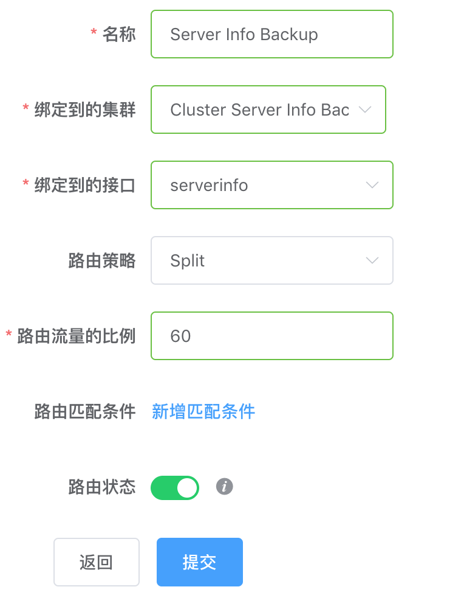

# Tutorial
If you have not dealt much with HTTP gateway before and want to deploy one in your company or just play with one, then congradulations, you have come to the right place!  
This tutorial is very user-friendly. It aims to assist first-timers to have a hands-on experience without going through the pain of searching, asking and wondering.  
This was tested on a **MacOS** environment.  
If you encounter any problem going through the tutorial, feel free to create an issue or send me an email to this address **brucewangno1@qq.com** with the subject "Issues with Gateway Tutorial."

## ETCD Setup
ETCD is a distributed key-value storage required to store **Gateway configurations**.  
You need an ETCD server or a cluster of them running.  
Follow the directions on [this page](https://github.com/etcd-io/etcd/blob/master/Documentation/op-guide/container.md#docker).

## Gateway Setup
### Download this project
Under **$GOPATH/src/github.com/fagongzi**, run  
```shell
git clone https://github.com/fagongzi/gateway.git
```

### Compile this project
Make sure your Go version is **1.10** or above. Otherwise error will occurs.
In the root directory of this project, there is a **Makefile** which is responsible to generate the executables and the static Web UI. Under the root directory of this project, run  
```shell
make
```  
to generate executables **apiserver** and **proxy** , found under directory **dist**; run  
```shell
make ui
```  
to generate the UI directory under dist, which is the Web UI needed by **apiserver**.

## Gateway Service Online
### Run executables
So now there is a ETCD or a cluster of ETCD Docker containers running.  
Under directory **dist**, run the following two command lines in two separate terminal tabs in a termial (**iTerm** highly recommended) 
```shell
sudo ./proxy --addr=127.0.0.1:80 --addr-rpc=127.0.0.1:9091 --addr-store=etcd://127.0.0.1:2379 --namespace=test
./apiserver --addr=127.0.0.1:9091 --addr-store=etcd://127.0.0.1:2379 --discovery --namespace=test -ui=ui/dist
```
to start proxy and apiserver.

## Backend Mock Service
### Start three servers
Under the directory **cmd/backend**, there is the file **backend.go**. This is a backend mock service. It have many simple APIs like the one returning the hostname, ip and port of the server.  
Start up 3 terminal tabs and run the following commands in these 3 tabs, respectively. 
```shell
go run backend.go --addr=localhost:9000
go run backend.go --addr=localhost:9001
go run backend.go --addr=localhost:9002
```
Alright, alright, alright. You now have three servers which provide the same service and will later form a cluster by configurations on the Web UI.

## Gateway Configuration
There are two ways to configure Gateway which is responsible for stuff like redirecting traffic. The first one is through Web UI and the second is through GRPC.

### Through the Web UI
Web UI is at http://localhost:9093/ui/index.html#/home. Please do not try to access http://localhost:9093. Instead of the Web UI showing up, you get  
```json
{"message":"Not Found"}
```
A rookie mistake. In the future, this issue might be resolved.  

#### Web UI front page:
  
1. Click on "Cluster" on the side bar and add a cluster. Let's name it "Cluster Server Info". For now the only load balance algorithm you could choose is "Round Robin".  
2. Click on "Server" on the side bar and add the three servers you just started. QPS stands for Requests Per Second. 1000 is enough for our tutorial. /check is used by a health check mechanism.  

3. Click on "API" on the side bar and add an API.  
  
The retry strategy is to retry sending a request to a cluster after 10ms if it failed last time.  


The configuration is all set up.

## Postman
### Download Postman
Click on [the link](https://www.getpostman.com/downloads/) to open the download page.

### Create a HTTP Get request
Remember to add the **Host** field in **Headers**. Otherwise it will not work.


### Click On "Send"
And voila! You have something like 
```html
Johns-MacBook-Pro.local
localhost:9002
```  
Notice that almost every time you click on **Send**, server address changes. This is because of the Round Robin load balance strategy.

## Bonus Round
### Routing Strategy
1. Create three more servers with ip:ports: "localhost:9003", "localhost:9004", "localhost:9005".  
2. Create a cluster called "Cluster Server Info Backup"  
3. Click on "Routing" on the side bar and add a routing. Our **Split** routing strategy reroutes 60% of all the API traffic initially bound to **Cluster Server Info** to our designated cluster **Cluster Server Info Backup**.
  
If you keep clicking on "Send" enough times, you will find that approximately 60% of all your HTTP Get requests goes to the second cluster.
